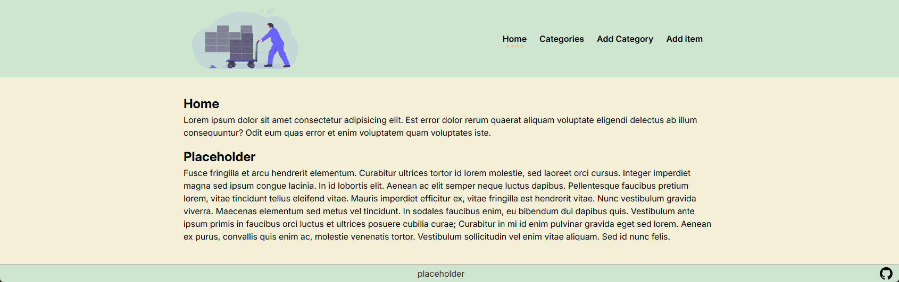
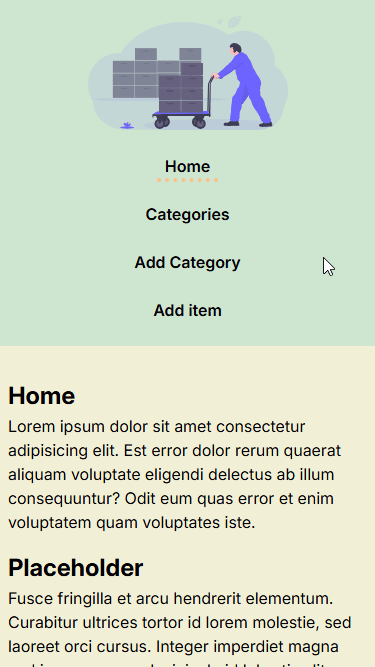

<!-- Improved compatibility of back to top link: See: https://github.com/othneildrew/Best-README-Template/pull/73 -->

<a name="readme-top"></a>

<!--
*** Thanks for checking out the Best-README-Template. If you have a suggestion
*** that would make this better, please fork the repo and create a pull request
*** or simply open an issue with the tag "enhancement".
*** Don't forget to give the project a star!
*** Thanks again! Now go create something AMAZING! :D
-->

<!-- PROJECT SHIELDS -->
<!--
*** I'm using markdown "reference style" links for readability.
*** Reference links are enclosed in brackets [ ] instead of parentheses ( ).
*** See the bottom of this document for the declaration of the reference variables
*** for contributors-url, forks-url, etc. This is an optional, concise syntax you may use.
*** https://www.markdownguide.org/basic-syntax/#reference-style-links
-->
<!-- [![Contributors][contributors-shield]][contributors-url] -->
<!-- [![Forks][forks-shield]][forks-url]
[![Stargazers][stars-shield]][stars-url]
[![Issues][issues-shield]][issues-url]
[![MIT License][license-shield]][license-url]
[![LinkedIn][linkedin-shield]][linkedin-url] -->

<!-- PROJECT LOGO -->
<br />
<div align="center">
  <a href="https://inventory-application-mikey-cos.fly.dev/">
    
  </a>

<h3 align="center">ProjectName</h3>

  <p align="center">
    Inventory Application with CRUD methods and form validation.
    <br />
    <a href="https://inventory-application-mikey-cos.fly.dev/">Live Preview</a>
    ·
    <a href="./PROJECT_SPECIFICATIONS.md">Project Specifications</a>
    <!-- ·
    <a href="https://github.com/github_username/repo_name/issues/new?labels=bug&template=bug-report---.md">Report Bug</a>
    ·
    <a href="https://github.com/github_username/repo_name/issues/new?labels=enhancement&template=feature-request---.md">Request Feature</a> -->
    ·
    <a href="https://github.com/mikeyCos/inventory-application/blob/main/CHANGELOG.md">Changelog</a>
  </p>
</div>

<!-- TABLE OF CONTENTS -->
<details>
  <summary>Table of Contents</summary>
  <ol>
    <li>
      <a href="#about-the-project">About The Project</a>
      <ul>
        <li><a href="#built-with">Built With</a></li>
      </ul>
    </li>
    <li>
      <a href="#getting-started">Getting Started</a>
      <ul>
        <li><a href="#prerequisites">Prerequisites</a></li>
        <li><a href="#installation">Installation</a></li>
      </ul>
    </li>
    <li><a href="#usage">Usage</a></li>
    <li><a href="#roadmap">Roadmap</a></li>
    <!-- <li><a href="#contributing">Contributing</a></li>
    <li><a href="#contact">Contact</a></li> -->
    <li><a href="#acknowledgments">Acknowledgments</a></li>
    <li><a href="#questions">Questions</a></li>
  </ol>
</details>

<!-- ABOUT THE PROJECT -->

## About The Project

[![Inventory Application Screen Shot][product-screenshot]](https://inventory-application-mikey-cos.fly.dev/)

Project: Inventory Application

Hello world,

I am excited and thankful for getting this project to it's current state. I barely made progress before taking a programming hiatus for what felt like 3 months. When I returned, I had to re-comprehend what progress I made, what/how modules connected to one another, and how to run application and database on local machine. For my PaaS (Platform as a Service), I decided to use Fly.io for hosting the server and database. Running the server and database locally required forwarding the server port and ensuring the database machine is online.

My main objective for this project was to implement CRUD (Created, Read, Update, and Delete) methods. Users can either navigate with the address bar or the built-in navigation bar. On the navigation bar, a user can click on 'Home', 'Categories', 'Add Category', or 'Add Item' and the corresponding page will render. For example, clicking on 'Categories' will render the `categories` view. Currently, editing and deleting categories/items require a placeholder password.

Early on, I did not know if it makes sense to break up routes and controllers down to the functionalities. For instance, I originally had edit/delete routers and controllers with the root path of `edit`/`delete`. Since then, I combined those methods into respective controllers and based the root path on `category` or `item`. For example, `getDeleteCategory` was moved from `deleteController.js` module to the `categoriesController.js` module, and changed the path from `/delete/:category` to `/category/delete/:category`.

One problem I was unable to solve was using `button` elements to show a modal, `dialog` element, for a category or item while changing the URL on the address bar. For example, clicking an item's edit button will show a modal with a form populated with the item's data (category, item name, UPC, quantity, unit price). If a user is on a category page, clicking an item's edit button will route from `/category/:category` to `/item/edit/:upc/:category` path. I tried to control a modal with request queries, but I could not think of a solution to send an item's data from one route to another and then rendering that data on a form. I think hiding the modal will present another problem, redirecting back to the item's category page. Maybe a solution is more suitable for the front-end instead of the back-end.

A problem I took a detour and somewhat solved was validating request queries. This was not required or state in the project's specifications, but I asked myself "how would I handle invalid request queries?" Furthermore, I asked myself "how do I handle if one mandatory query key depended on another mandatory query key and either one did not exist?", "does it make sense to run a validation chain when the request query is empty?", and "what should happen if the request query is not empty but has invalid query keys?" For now, the `queryValidator.js` module optionally validates an `action` query which is defined on `POST` requests and used on `GET` requests. The valid values for `action` query are "add", "edit", and "delete". I like to try to validate only if the request query is not empty, and run the validation chain without the `optional` modifier. Otherwise, if the request query is empty, then call the next middleware. However, I wanted to redirect to the current path without queries.

One thing that still blows my mind, the pages, the elements are being rendered from the back-end. I get to write HTML templates while using dynamic data and elements. Depending on local variables, a view can either render a particular HTML element and/or nested HTML templates. Furthermore, I learned how and when to run SQL queries before rendering a view. For example, navigating to `/categories` will select the rows from the database's categories table, store that value into `res.locals.categories`, render the view `categories.ejs`, and includes a nested template from `../partials/categories` path. Users will see categories that exist in the database on `/categories` path.

In order to use categories on the navigation bar, I learned that I can run the SQL query at an application-level middleware. In `app.js`, `res.locals.categories` is defined in a middleware right before any routers are used. Since `header.ejs` partial is included on every view, the categories local variable will always be used. The categories local variable also gets used on the categories page. Since the SQL query runs at the application-level, there is no need to rerun the SQL query in `categoriesController.js` when users navigate to `/categories`.

The project's current state fulfills the project specifications. Users can add categories and items without a password. Editing and deleting categories or items will require a password. If the URL in the address bar does not match any routes, then a `404` page will appear. If a deleted category has items assigned to it, those items are automatically reassigned to the unassigned category; the unassigned category cannot be edited or deleted. I do believe this project is a great way to practice implementing the MVC (Model-View-Controller) pattern, connect and run queries to a SQL database, and handling valid/invalid forms on POST requests. It was a unique experience and I am excited for the next project.

To failing forward, cheers!

<p align="right">(<a href="#readme-top">back to top</a>)</p>

### Built With

[![JavaScript][JavaScript.js]][JavaScript-url]
[![Node][NodeJS]][NodeJS-url]
[![Express][Express.js]][Express-url]
[![EJS][EJS]][EJS-url]
[![CSS3][CSS3]][CSS3-url]

<p align="right">(<a href="#readme-top">back to top</a>)</p>

<!-- GETTING STARTED -->

## Getting Started

To get a local copy up and running follow these simple example steps.

### Prerequisites

This is an example of how to list things you need to use the software and how to install them.
* npm
  ```sh
  npm install npm@latest -g
  ```

### Installation

1. Clone repository
      1. Clone [inventory-application repository](https://github.com/mikeyCos/inventory-application) using HTTPS/SSH/GitHub CLI; [more on cloning a repository](https://docs.github.com/en/repositories/creating-and-managing-repositories/cloning-a-repository).
      2. Navigate to cloned repository.
      3. Remove `.git` folder.
      4. Run `git init`.
      5. Run `git branch -M main`.
      6. Create a new repository on GitHub.
      7. Run `git remote add origin REPLACE_WITH_SSH_OR_HTTPS`.
      8. Run `git add . && git commit`.
2. Navigate to local repository and install NPM packages with `npm install`.

<p align="right">(<a href="#readme-top">back to top</a>)</p>

<!-- USAGE EXAMPLES -->

## Usage

Use navigation or address bars to traverse the application. Clicking the icon in the header will load the root path which is the home page. Navigating to `/categories` or hovering over the categories navigation item will show all categories currently stored on the database. Clicking a category will send a `GET` request with `/category/:category` path and load any items assigned to the category.

All form inputs marked with a red asterisk are required to be correctly filled. Adding a category requires a string to be between 3 and 20 characters long, and the value cannot be an existing category. Adding or editing an item requires a category, item name, and UPC (Universal Product Code); if the category input is left blank, it defaults to "unassigned". The UPC must not be an existing item. The item name requires a string to be between 3 and 30 characters long. The UPC requires to be between 10 and 12 digits long. Quantity and unit price are not required but cannot be a negative numbers.

Editing or deleting a category or item requires a password. Editing a category requires a new non-existing category. The UPC can be reused when editing an item. The form inputs, except for the password input, are `readonly` when deleting a category or item. 

Currently, a 404 page will render when paths, parameters, and queries are invalid. For instance, going to `category/bevera` will render the application at a 404 page; the navigation bar can still be used.

<div align="center">
  <a href="./demo/media/overview.gif">
    
  </a>

  _For more examples, please refer to the [Demo](./demo/DEMO.md)_
</div>

<p align="right">(<a href="#readme-top">back to top</a>)</p>

<!-- ROADMAP -->

## Roadmap

- [x] Build skeleton components.
- [x] Build a reusable form for adding and updating items.
- [x] Build a reusable form for adding and updating categories.
- [ ] Build a delete and edit confirmation modal.
  - [ ] Delete modal will have `confirm` and `cancel` buttons.
  - [ ] Edit modal will include a form with input content.
- [x] Build custom validator to check for duplicate categories and items.
- [ ] Build a request query parameter validator.
- [ ] Build search item by category or upc functionality.
- [ ] Divide items table into separate tables; prices, quantities, locations.
- [ ] Build edit/delete forms on the `categories` page; toggled by edit/delete/cancel/submit buttons.
- [ ] Allow user to type in category input and have a drop down select for existing categories.
- [ ] Build undo functionality.
- [ ] Refine `404` page by specifying the error(s). 

<p align="right">(<a href="#readme-top">back to top</a>)</p>

<!-- CONTACT -->

## Contact

Your Name - [@twitter_handle](https://twitter.com/twitter_handle) - email@email_client.com

Project Link: [https://github.com/mikeyCos/cv-application](https://github.com/mikeyCos/cv-application)

<p align="right">(<a href="#readme-top">back to top</a>)</p>

<!-- ACKNOWLEDGMENTS -->

## Acknowledgments

- [Best README Template](https://github.com/othneildrew/Best-README-Template)
- [Fly.io](https://fly.io/)
<!-- - []() -->
<!-- - []() -->

<p align="right">(<a href="#readme-top">back to top</a>)</p>

<!-- QUESTIONS -->

## Questions

1. How to validate request query parameters? What if any of the query parameters are invalid? What if any of the query parameters' values are invalid?
2. Are `res.redirect` preferred on `POST` requests after validations return no errors?
3. Does it make sense to dynamically insert scripts or style sheets into the `head` element? For example, defining a local variable called `styleSheets` that is an array of paths.
4. When does it make sense to store null values in a table?
5. Where does it make sense to validate request queries and/or parameters? On the controller or router?
6. How to dynamically render a modal including a form with or without pre-populated inputs while changing the route? Is the front-end more suitable for this task?
7. When does it make sense to export an object instead of individual functions wrapped in an object? For example, the `*Controller.js` modules are defined and exported as objects, whereas the `queries.js` module, functions are individually defined and exported.

<p align="right">(<a href="#readme-top">back to top</a>)</p>

<!-- MARKDOWN LINKS & IMAGES -->
<!-- https://www.markdownguide.org/basic-syntax/#reference-style-links -->

[contributors-shield]: https://img.shields.io/github/contributors/github_username/repo_name.svg?style=for-the-badge
[contributors-url]: https://github.com/github_username/repo_name/graphs/contributors
[forks-shield]: https://img.shields.io/github/forks/github_username/repo_name.svg?style=for-the-badge
[forks-url]: https://github.com/github_username/repo_name/network/members
[stars-shield]: https://img.shields.io/github/stars/github_username/repo_name.svg?style=for-the-badge
[stars-url]: https://github.com/github_username/repo_name/stargazers
[issues-shield]: https://img.shields.io/github/issues/github_username/repo_name.svg?style=for-the-badge
[issues-url]: https://github.com/github_username/repo_name/issues
[license-shield]: https://img.shields.io/github/license/github_username/repo_name.svg?style=for-the-badge
[license-url]: https://github.com/github_username/repo_name/blob/master/LICENSE.txt
[linkedin-shield]: https://img.shields.io/badge/-LinkedIn-black.svg?style=for-the-badge&logo=linkedin&colorB=555
[linkedin-url]: https://linkedin.com/in/linkedin_username
[Next.js]: https://img.shields.io/badge/next.js-000000?style=for-the-badge&logo=nextdotjs&logoColor=white
[Next-url]: https://nextjs.org/
[React.js]: https://img.shields.io/badge/React-20232A?style=for-the-badge&logo=react&logoColor=61DAFB
[React-url]: https://reactjs.org/
[Vue.js]: https://img.shields.io/badge/Vue.js-35495E?style=for-the-badge&logo=vuedotjs&logoColor=4FC08D
[Vue-url]: https://vuejs.org/
[Angular.io]: https://img.shields.io/badge/Angular-DD0031?style=for-the-badge&logo=angular&logoColor=white
[Angular-url]: https://angular.io/
[Svelte.dev]: https://img.shields.io/badge/Svelte-4A4A55?style=for-the-badge&logo=svelte&logoColor=FF3E00
[Svelte-url]: https://svelte.dev/
[Laravel.com]: https://img.shields.io/badge/Laravel-FF2D20?style=for-the-badge&logo=laravel&logoColor=white
[Laravel-url]: https://laravel.com
[Bootstrap.com]: https://img.shields.io/badge/Bootstrap-563D7C?style=for-the-badge&logo=bootstrap&logoColor=white
[Bootstrap-url]: https://getbootstrap.com
[JQuery.com]: https://img.shields.io/badge/jQuery-0769AD?style=for-the-badge&logo=jquery&logoColor=white
[JQuery-url]: https://jquery.com
[JavaScript-url]: https://www.javascript.com/
[JavaScript.js]: https://img.shields.io/badge/javascript-20232A?style=for-the-badge&logo=javascript
[NodeJS]: https://img.shields.io/badge/node.js-6DA55F?style=for-the-badge&logo=node.js&logoColor=white
[NodeJS-url]: https://nodejs.org/en
[Express.js]: https://img.shields.io/badge/express.js-%23404d59.svg?style=for-the-badge&logo=express&logoColor=%2361DAFB
[Express-url]: https://expressjs.com/
[EJS]: https://img.shields.io/badge/ejs-%23B4CA65.svg?style=for-the-badge&logo=ejs&logoColor=black
[EJS-url]: https://ejs.co/
[CSS3]: https://img.shields.io/badge/css3-%231572B6.svg?style=for-the-badge&logo=css3&logoColor=white
[CSS3-url]: https://www.w3.org/TR/2001/WD-css3-roadmap-20010523/
[product-screenshot]: ./demo/media/project_screenshot_01.png